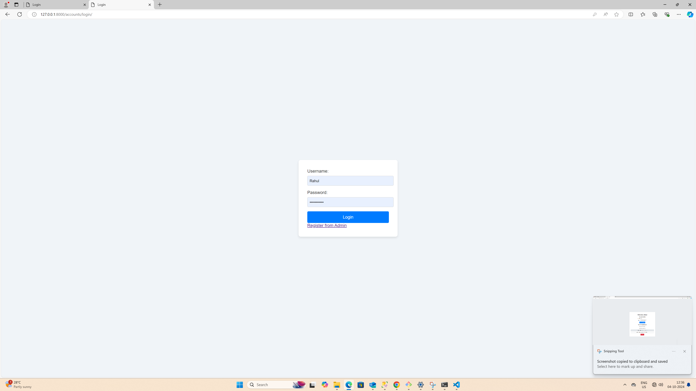

# Dashboard Project

## Description
This project is a Django-based dashboard application that allows users to manage their accounts. It features user authentication and an admin panel for managing user accounts and viewing data.

## Features
## Features
- **User Authentication**: Only authenticated users can access the dashboard.
- **Dynamic Dashboard**: Displays user-specific data such as profile details and recent activities.
- **Admin Customization**: Admin interface for managing users and their activities.
- **Profile Update Form**: Users can update their profile information.

## Setup Instructions

### Prerequisites
- Python 3.x
- Django 5.1.x
- Git

##images

 
 
 

