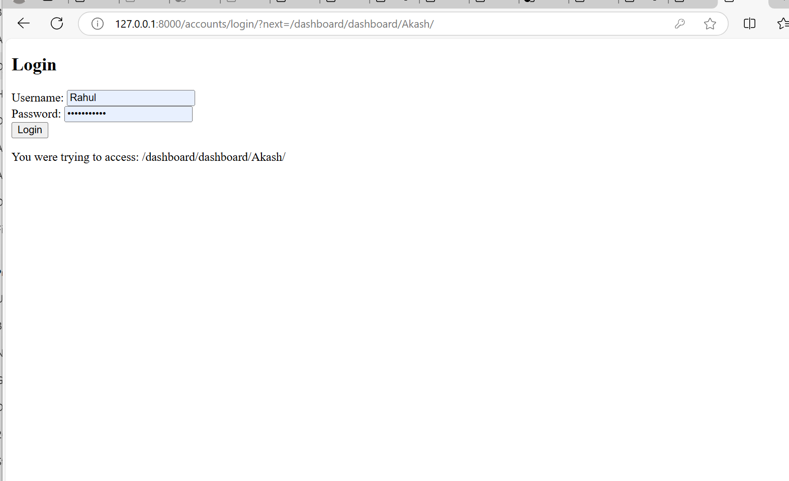

# Dashboard Project

## Description
This project is a Django-based dashboard application that allows users to manage their accounts. It features user authentication and an admin panel for managing user accounts and viewing data.

## Features
- User login and authentication
- Dashboard for users
- Admin panel for managing users

## Setup Instructions

### Prerequisites
- Python 3.x
- Django 5.1.x
- Git

### Clone the Repository
To get started, clone the repository to your local machine:

```bash
git clone https://github.com/yourusername/Dashboard.git
cd Dashboard

python -m venv venv

venv\Scripts\activate


pip install -r requirements.txt
python manage.py migrate
python manage.py runserver

# at local it will redicat admin login
# after logout from loacal it will rediract to use login
#after login useer it will show dashboard and activites of done by user
#
#
#